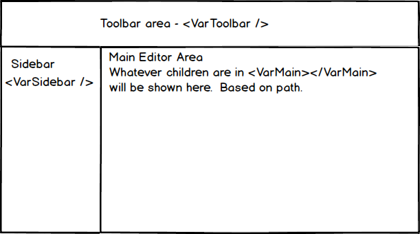

# Analytix Variable Editor

## Introduction

This is an electron application, which for all practical purposes, kicks off in the ***App.js*** file in the root of the **src** directory.

It is using Reach Router to provide routing, Redux for state management and Styled-Components for styling.

## Components / Application Flow

### App.js

Note that in ***App.js***, the *componentDidMount*() function is navigating to the path "**/qvvar**".  The thought being that potentially in the future there would be a single application for variables and groups.  The base path of "/" would then be a home/starting screen.

***App.js*** is will also initialize (create the store) for Redux and provide the initial Router for the application.

```jsx
<React.Fragment>
	<GlobalStyle />
    <Header title="Analytix Variable Editor" linkTo="/qvvar" />
    <Provider store={store}>
	    <Router>
    		<Main path="/" />
					<QvVariables path="/qvvar">
						<VarView path=":appId/" />
						<VarAdd path=":appId/varadd" />
						<VarExport path=":appId/varexport" />
					</QvVariables>
			<Settings path="/settings" />
    		<Error default />
		</Router>
	</Provider>
</React.Fragment>
```

### QvVariables.js

QvVariables.js is the variable editor starting point.  It sets up a Grid with a Toolbar area for toggling between **Viewing** Variables, **Adding** Variables and **Exporting** Variables.



The Sidebar will show a list of applications


